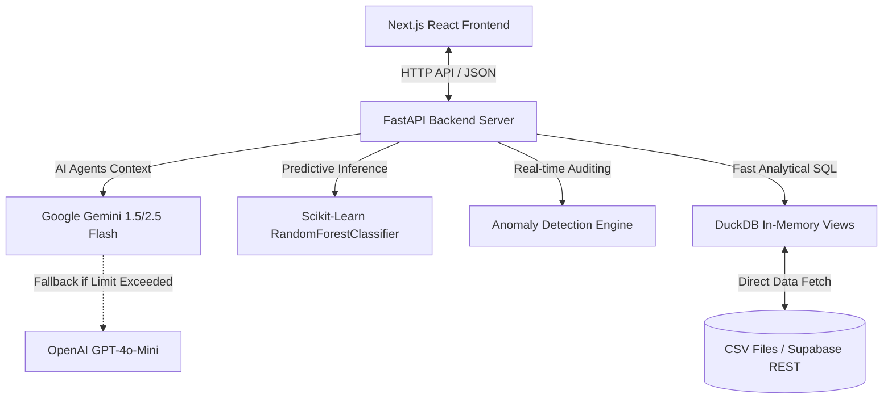

# Agentic Game Data Analytics Platform
> **Nền tảng Phân tích Dữ liệu Game tích hợp Trợ lý AI (Next.js + FastAPI + DuckDB + Machine Learning)**

A fully functional, AI-powered game data analytics platform. Users can query their game's players, monetization, and surveys using natural language. The system translates queries to DuckDB SQL, executes them over local CSVs (or Supabase REST API), generates interactive charts, provides business insights, and executes automated customer retention campaigns.

*Một nền tảng phân tích dữ liệu game hoàn chỉnh sử dụng AI. Người dùng có thể truy vấn thông tin người chơi, doanh thu và khảo sát bằng ngôn ngữ tự nhiên. Hệ thống sẽ tự động dịch sang DuckDB SQL, truy vấn trực tiếp trên file CSV hoặc đồng bộ từ Supabase, hiển thị biểu đồ trực quan, đề xuất insight và hỗ trợ kích hoạt chiến dịch giữ chân khách hàng (retention) tự động.*

---

## 🗺️ System Architecture (Kiến trúc Hệ thống)



---

## ✨ Key Features (Tính năng Nổi bật)

### 1. Natural Language Data Agent (Truy vấn Ngôn ngữ Tự nhiên)
- Ask complex questions in **English** or **Vietnamese** (e.g., *"Doanh thu theo ngày?", "Average rating for pricing?"*).
- Translated to SQL automatically using **Google Gemini 2.5 Flash** (with automatic fallback to **OpenAI GPT-4o-Mini** if Gemini API rate limits are hit).
- *Tự động chuyển câu hỏi tiếng Anh/Việt thành DuckDB SQL qua Gemini Flash (tự động chuyển sang OpenAI nếu quá tải quota).*

### 2. Auto-Visualization & Custom Recharts (Vẽ Biểu đồ Tự động)
- Automatically detects the structure of query results and plots them in **6 interactive chart types** (Bar, Line, Pie, Area, Scatter, Radar) using Recharts.
- Supports light and dark mode styling synchronized dynamically with system theme switches.
- *Phát hiện cấu trúc dữ liệu để vẽ 6 loại biểu đồ (Cột, Đường, Tròn, Vùng, Phân tán, Mạng nhện) đồng bộ với giao diện Sáng/Tối.*

### 3. Machine Learning Player Retention (/predict churn)
- Fits a local `RandomForestClassifier` on player statistics (Playtime, Level, Total spent, VIP tier) to predict high-risk active players.
- Provides immediate retention triggers (e.g. sending a custom giftcode and apology email directly from the UI).
- *Sử dụng mô hình học máy RandomForestClassifier dự đoán xác suất rời bỏ game (churn) và đề xuất gửi giftcode kích cầu trực tiếp.*

### 4. Live Anomaly Detection (Cảnh báo Bất thường trên Dữ liệu Thật)
- Runs automated background scripts checking for critical conditions:
  - **Spike in 1-Star Bug Reports**: Triggers if 15 or more 1-star reviews mention game bugs/lag.
  - **VIP Spending Drop**: Triggers if Gold VIP total revenue falls below Silver VIP revenue.
- *Hệ thống cảnh báo Đỏ (Critical) khi có bão 1-sao/Bug hoặc cảnh báo Vàng (High) khi doanh thu khách VIP Gold bị sụt giảm hơn Silver.*

---

## 📂 Project Structure (Cấu trúc Thư mục)

```bash
├── api.py               # FastAPI backend endpoints (CORS, Chat, ML, Anomalies)
├── agents.py            # LLM Agents (SQL Generation, Visualization, Insight)
├── ml_predictor.py      # Scikit-Learn RandomForest model logic
├── anomaly_detector.py  # Anomaly detection logic on live CSV/Supabase data
├── db.py                # Database helper (reads local CSVs or syncs Supabase via REST)
├── data_generator.py    # Generates mock data CSVs
├── requirements.txt     # Python backend dependencies
├── demo.txt             # Step-by-step anomaly demonstration guide
└── frontend/            # Next.js (TypeScript, TailwindCSS, Recharts, Framer Motion)
```

---

## 🚀 Getting Started (Hướng dẫn Cài đặt)

### 🛠️ 1. Backend Setup (Cấu hình Backend)

1. **Install Python dependencies (Python 3.9+ recommended):**
   ```bash
   pip install -r requirements.txt
   ```
2. **Configure Environment Variables:**
   Create a `.env` file in the root directory:
   ```env
   GEMINI_API_KEY="YOUR_GEMINI_API_KEY"
   
   # Optional: OpenAI fallback
   OPENAI_API_KEY="YOUR_OPENAI_API_KEY"

   # Optional: Supabase Data sync (Falls back to local CSVs if empty)
   SUPABASE_URL="https://your-project.supabase.co"
   SUPABASE_KEY="your-anon-or-service-role-key"
   ```
3. **Generate Mock Data:**
   Run the data generator to create local `users_segment.csv`, `payments.csv`, and `surveys.csv`.
   ```bash
   python data_generator.py
   ```
4. **Run the FastAPI server:**
   ```bash
   uvicorn api:app --host 0.0.0.0 --port 8000 --reload
   ```

### 💻 2. Frontend Setup (Cấu hình Frontend)

1. **Navigate to the frontend folder and install dependencies:**
   ```bash
   cd frontend
   npm install
   ```
2. **Run the Next.js development server:**
   ```bash
   npm run dev
   ```
   Open [http://localhost:3000](http://localhost:3000) on your browser.

---

## 📊 How to Demo Live Anomaly Warnings (Hướng dẫn Trình diễn Cảnh báo)

You can demonstrate how the system responds dynamically to changes in real-time data:

### 🔴 Scenario 1: Triggering "Spike in 1-Star Bug Reports"
1. Open `surveys.csv` using VS Code or any text editor.
2. Scroll to the end of the file and paste 2 new bug report lines:
   ```csv
   SRV99998,U00123,2026-06-17,1,The game is full of bugs and crashes,Bugs
   SRV99999,U00456,2026-06-17,1,Terrible lag and bug everywhere,Bugs
   ```
3. Save the file and refresh the browser. The Alert Widget on the bottom-right corner will show a **Red Critical Alert**. Click the action button to distribute a giftcode!

### 🟡 Scenario 2: Resolving "VIP Spending Drop Detected"
1. At start, you may see a **Yellow Warning** indicating Gold VIP revenue ($2,005) is lower than Silver ($12,148) due to randomized generation weights.
2. Open `payments.csv` and add a high-paying Gold player transaction at the bottom of the file (e.g. Gold User `U00810` making a $15,000 purchase):
   ```csv
   TXN999999,U00810,2026-06-17,15000.00,Gems
   ```
3. Save the file and refresh the browser. The warning will disappear immediately because Gold VIP revenue ($17,005) is now greater than Silver!

---

## ⚡ Deployment (Triển khai)

- **Backend**: Can be hosted on Render, Railway, or Heroku (FastAPI handles CORS automatically).
- **Frontend**: Easiest deployment is on Vercel. Ensure you add `NEXT_PUBLIC_API_URL` environment variable pointing to your deployed backend URL.
